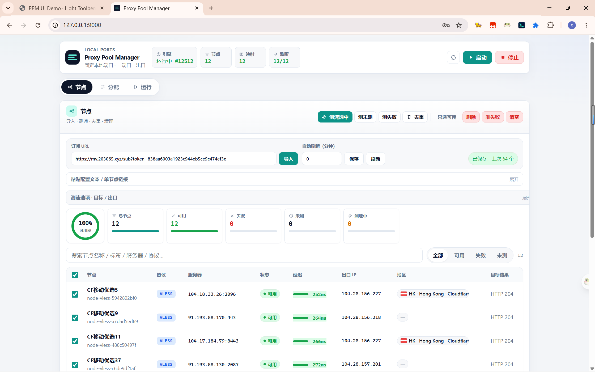
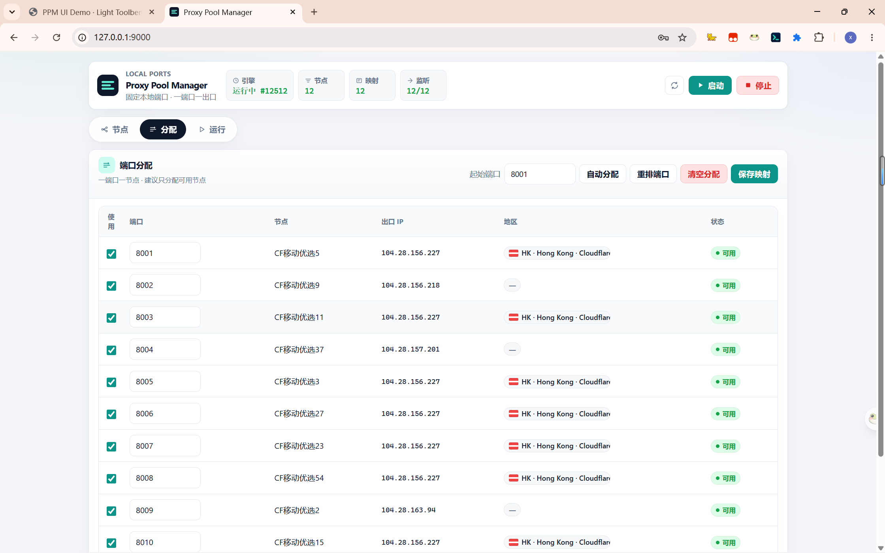
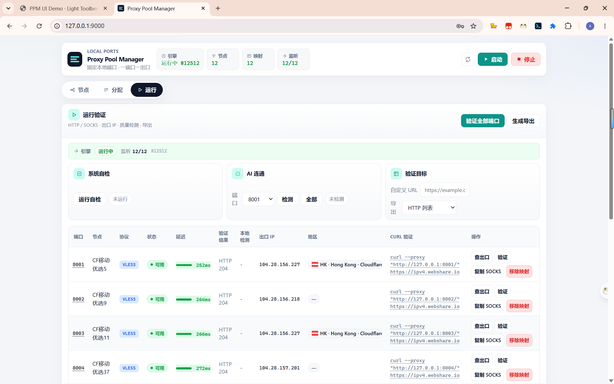

# Proxy Pool Manager


> 本地代理端口管理工具 · 导入订阅/测速去重/端口固定映射/sing-box 引擎/AI 连通性检测





本项目是一个本地代理端口管理工具。它把多个代理节点固定绑定到不同本地 SOCKS5 端口，让不同账户可以稳定使用不同出口 IP。

## 特性

- **3 Tab 控制台**：节点（导入+测速）/ 分配 / 运行，浅色 Toolbench 风格
- **多协议导入**：vless / vmess / ss / trojan / hysteria2 / tuic / anytls / Clash YAML / Base64 订阅
- **测速去重**：临时启动 sing-box 验证延迟和出口 IP，同 IP 自动保留最快节点
- **端口固定映射**：一端口一节点，sing-box `mixed` inbound 同时支持 HTTP + SOCKS5
- **GeoIP 多源回退**：geojs → ipwho → freeipapi → ipinfo → ip-api，失败 1h 自动重试
- **AI 连通性检测**：通过代理端口测试 GPT / Claude / Gemini 可达性
- **可视化管理**：可用率圆环、协议分色 chip、延迟进度条、地区 flag chip

## 核心原则

- 每个本地端口固定对应一个节点。
- 正式代理流量只经过 sing-box。
- Python 只负责导入、解析、生成配置、启动进程和 Web 管理。
- 状态和映射持久化到 `config/assignments.json`。

## 功能清单

| 功能 | 状态 |
|------|------|
| FastAPI 管理服务 | ✅ |
| 纯 HTML/CSS/JS Web UI（3 Tab） | ✅ |
| 节点导入（vless/vmess/ss/trojan/hysteria2/tuic/anytls/Clash/Base64） | ✅ |
| 端口映射保存 | ✅ |
| sing-box 配置生成 + 自动下载 + check 校验 | ✅ |
| 出口 IP 查询 | ✅ |
| GeoIP 多源回退（geojs/ipwho/freeipapi/ipinfo/ip-api） | ✅ |
| 节点测速 + 同 IP 去重 | ✅ |
| 运行后端口验证 | ✅ |
| AI 连通性检测（GPT/Claude/Gemini） | ✅ |
| HTTP + SOCKS5 混合代理端口 | ✅ |
| 单元测试 + API smoke test（121 passed） | ✅ |
| SSR / 多订阅合并 / 流量统计 / TUN 模式 | ❌ |

## 快速安装

Windows：

```powershell
powershell -ExecutionPolicy Bypass -File .\scripts\install-windows.ps1
.\scripts\start-service.ps1
```

如果已经手动下载了 sing-box Windows 压缩包：

```powershell
powershell -ExecutionPolicy Bypass -File .\scripts\install-windows.ps1 -SingBoxZip "C:\Users\dsk\Downloads\sing-box-1.13.13-windows-amd64.zip"
```

Linux：

```bash
chmod +x scripts/*.sh
sudo bash scripts/install-linux.sh --systemd --start
```

安装脚本会创建 `.venv`、安装 Python 依赖、下载对应平台的 sing-box 核心，构建 Linux 版 `proxycheck-api/proxycheck`，生成默认 `config/app.json`，并注册 `proxy-pool-manager` systemd 服务为开机自启。

后续更新：

```bash
bash scripts/update-linux.sh
```

这会执行 `git pull --ff-only`、同步 Python 依赖，并重启 systemd 服务。没有 systemd 的环境仍可手动运行：

```bash
./scripts/install-linux.sh
./scripts/start-service.sh
```

Docker / VPS：

```bash
cp config/app.docker.example.json config/app.json
sed -i 's/change-this-admin-key/你的强管理密钥/' config/app.json
docker compose up -d --build
```

默认 compose 只把控制台绑定到宿主机 `127.0.0.1:9100`，适合在 VPS 上用 Nginx/Caddy 反代 HTTPS。代理端口需要给外部用户使用时，再在 `docker-compose.yml` 里打开对应端口范围，例如 `8001-8062:8001-8062`。

如果你要把 `9100:9100` 直接暴露到公网，必须设置 `admin_key` 或环境变量 `PPM_ADMIN_KEY`，否则控制台没有登录保护。
前端样式或登录页改动后，记得 `docker compose up -d --build`，并确认页面底部资源版本号已经更新。

如果 Linux 服务器没有安装 Go，本地 proxycheck 检测会不可用。安装 Go 后执行：

```bash
cd proxycheck-api
go build -o proxycheck ./cmd/proxycheck
```

环境自检：

```bash
./scripts/doctor.sh
```

Windows：

```powershell
powershell -ExecutionPolicy Bypass -File .\scripts\doctor.ps1
```

手动安装依赖也可以：

```powershell
python -m pip install -r requirements.txt
```

## 启动

```powershell
python main.py
```

然后打开：

```text
http://127.0.0.1:9000
```

Windows 使用脚本：

```powershell
.\scripts\start-service.ps1
.\scripts\status-service.ps1
.\scripts\stop-service.ps1
```

Linux 使用脚本：

```bash
sudo systemctl start proxy-pool-manager
sudo systemctl status proxy-pool-manager
sudo systemctl stop proxy-pool-manager
journalctl -u proxy-pool-manager -f
```

Web 端口和监听地址在这里改：

```text
config/app.json
```

详细运行、关闭、服务器部署说明见：

```text
docs/operation.md
```

## sing-box 路径

按以下顺序寻找：环境变量 `SING_BOX_PATH` → `bin/sing-box.exe` → 系统 PATH → 自动从 [SagerNet/sing-box](https://github.com/SagerNet/sing-box/releases) 下载。

> 已安装 v2rayN 可直接复用其 sing-box：
> ```powershell
> $env:SING_BOX_PATH="路径\v2rayN\bin\sing_box\sing-box.exe"
> python main.py
> ```

## 使用流程

1. **导入** → 「节点」页粘贴订阅 URL 或节点文本
2. **测速** → 点击「测速选中」，可选展开「测速选项」设目标 URL / 出口查询
3. **去重** → 点击「去重」自动按出口 IP 保留最快节点
4. **分配** → 「分配」页勾选节点 → 填端口 → 保存映射
5. **启动** → 顶栏「启动」按钮
6. **验证** → 「运行」页「验证全部端口」
7. **使用** → 本地 SOCKS5 / HTTP 端口：

```powershell
curl.exe --socks5 127.0.0.1:8001 https://api.ipify.org
```

```powershell
# SOCKS5
curl.exe --socks5 127.0.0.1:8001 https://api.ipify.org

# HTTP proxy
curl.exe --proxy "http://127.0.0.1:8001/" https://ipv4.webshare.io/
```

> 运行页支持单端口「查出口」「验证」，以及导出为代理列表 / CSV / JSON / curl 命令。验证目标默认 `webshare.io` / `google/gstatic 204` / `cloudflare trace`，也可自定义 URL。

## API

| 方法 | 路径 | 说明 |
|------|------|------|
| `GET` | `/` | Web UI |
| `GET` | `/api/status` | 服务和引擎状态 |
| `POST` | `/api/import` | 导入 URL 或文本 |
| `GET` | `/api/nodes` | 节点列表 |
| `POST` | `/api/nodes/delete` | 删除选中节点或清空节点 |
| `POST` | `/api/test` | 临时启动 sing-box 测试导入节点，可选按出口 IP 去重 |
| `POST` | `/api/test-ports` | 对已映射端口做运行后验证 |
| `PUT` | `/api/assign` | 保存端口映射 |
| `GET` | `/api/ports` | 查询端口映射 |
| `GET` | `/api/ports/{port}/ip` | 查询端口出口 IP |
| `GET` | `/api/proxy/fastest` | 返回最快可用代理；可加 `check=true` 做实时验证 |
| `POST` | `/api/start` | 启动 sing-box |
| `POST` | `/api/stop` | 停止 sing-box |

## 测试

```powershell
python -m compileall -q main.py app tests
python -m pytest -q
```

当前测试覆盖：

- 单节点链接解析。
- Clash YAML 解析。
- Hysteria2 链接解析。
- sing-box 配置生成。
- 状态持久化。
- API 导入、分配、状态查询 smoke test。
- 同出口 IP 去重逻辑。
- GeoIP 多源回退查询（geojs / ipwho / freeipapi / ipinfo / ip-api）。
- 前端 DOM 契约锁定（`app.js` 引用的 `id` / `data-tab` / API 路径必须在 `index.html` 和后端路由中存在）。

## 安全说明

- Web 服务默认只监听 `127.0.0.1:9000`。
- sing-box inbound 默认只监听 `127.0.0.1`。
- `config/assignments.json` 会保存代理凭据，不要提交到 git。
- 本项目不记录代理请求内容。

## License

MIT
